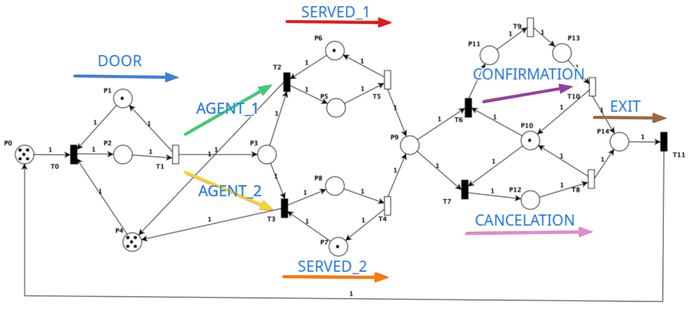

# TP2 - Concurrent Life

Repositorio del Trabajo Práctico N° 2 de **Programación Concurrente** (FCEFyN - UNC) - Año 2024.

> Modelado e implementación concurrente de una agencia de viajes. El sistema se representa como una **Red de Petri** de 15 plazas y 12 transiciones, y se simula con **hilos Java** que compiten por disparar transiciones bajo un monitor central.


---

## Autores

- **BERNARDI, Mateo**
- **LEDESMA, Ignacio**
- **MADRID, Santiago**

**Cátedra:** Programación Concurrente - Año 2024  
**Profesores:** Ventre, Luis Orlando · Ludemann, Mauricio

---

## Tabla de contenidos

- [TP2 - Concurrent Life](#tp2---concurrent-life)
  - [Autores](#autores)
  - [Tabla de contenidos](#tabla-de-contenidos)
  - [Descripción](#descripción)
  - [Resumen del proyecto](#resumen-del-proyecto)
    - [Modelado](#modelado)
    - [Concurrencia](#concurrencia)
      - [Política de señalización](#política-de-señalización)
      - [Política de resolución de conflictos](#política-de-resolución-de-conflictos)
      - [Semántica temporal (ventanas α)](#semántica-temporal-ventanas-α)
        - [Tabla de α por transición y política](#tabla-de-α-por-transición-y-política)
        - [Mecanismo](#mecanismo)
        - [Flujo en el monitor](#flujo-en-el-monitor)
    - [Persistencia](#persistencia)
    - [Validación](#validación)
    - [Para más detalle](#para-más-detalle)
  - [Requisitos](#requisitos)
  - [Compilación y ejecución](#compilación-y-ejecución)
    - [Compilar](#compilar)
    - [Formatear y validar estilo](#formatear-y-validar-estilo)
    - [Correr la simulación](#correr-la-simulación)
    - [Argumentos opcionales](#argumentos-opcionales)
    - [Configuración por defecto](#configuración-por-defecto)
  - [Estructura del proyecto](#estructura-del-proyecto)
  - [Diagramas](#diagramas)
  - [Red de Petri](#red-de-petri)
  - [Análisis con PIPE 4.3.2](#análisis-con-pipe-432)
    - [Capturas y resultados disponibles](#capturas-y-resultados-disponibles)
  - [Validación de invariantes](#validación-de-invariantes)
    - [Ejecución](#ejecución)
    - [Variantes de invariantes reconocidas](#variantes-de-invariantes-reconocidas)
  - [Resultados de las corridas](#resultados-de-las-corridas)

---

## Descripción

Se simula el funcionamiento de una agencia de viajes donde:

1. Clientes ingresan al local por una puerta.
2. Son atendidos por uno de dos agentes vendedores.
3. Tras la atención, el cliente pasa por una etapa de **confirmación** o **cancelación** de la reserva.
4. Finalmente sale del local.

El flujo se modela como una **Red de Petri** y se implementa con **hilos Java concurrentes** que disputan el disparo de transiciones. Un `Monitor` central arbitra garantizando exclusión mutua y resolviendo conflictos mediante una política configurable (balanceada o no balanceada).

Para más detalle teórico, experimental y de conclusiones, ver el [Informe TP2 - Concurrent Life](docs/Informe%20TP2%20-%20Concurrent%20Life.pdf).

---

## Resumen del proyecto

### Modelado

El sistema se modela como una Red de Petri de **15 plazas** y **12 transiciones**, con marcado inicial `{5, 1, 0, 0, 5, 0, 1, 1, 0, 0, 1, 0, 0, 0, 0}`. La estructura completa, junto con la asignación de plazas a hilos, se muestra en [`docs/PetriNet_tasks.png`](docs/PetriNet_tasks.png).

### Concurrencia

En total hay **8 hilos** (ver [`src/tasks/`](src/tasks/)) y [`src/util/Monitor.java`](src/util/Monitor.java) centraliza el disparo de transiciones: 

- Usa un `Semaphore` como mutex para garantizar exclusión mutua sobre la RdP.
- Usa una [`CL_Queue`](src/util/CL_Queue.java) de semáforos para bloquear a los hilos cuya transición no está habilitada.
- Al disparar una transición, despierta al siguiente hilo bloqueado cuya transición esté habilitada, seleccionándolo mediante una [`CL_Policy`](src/util/CL_Policy.java).

#### Política de señalización

[`src/util/Monitor.java`](src/util/Monitor.java) implementa una política de señalización basada en **handoff** o **pasaje directo de ejecución** entre hilos bloqueados por transición. Respecto de las políticas vistas en clase, se parece principalmente a una variante de **Signal and Exit (SX)**: el hilo que señaliza despierta a otro y sale del monitor. 

- **Mutex del monitor**: un `Semaphore(1, true)` en [`Monitor.java`](src/util/Monitor.java) garantiza exclusión mutua sobre la Red de Petri. Todo hilo que invoca `fireTransition(T)` intenta tomar este mutex al entrar al monitor.
- **Cola por transición**: cuando una transición no está habilitada, el hilo libera el mutex y se bloquea en un semáforo específico de esa transición dentro de [`CL_Queue.java`](src/util/CL_Queue.java). Estos semáforos se inicializan con 0 permisos y funcionan como mecanismo de señalización, no como mutex.
- **Bloqueo del hilo**: al no poder disparar, el hilo marca su transición como pendiente y se suspende:

  ```java
  waitingTransitions[transition] = 1;
  waitingThreads[transition].acquire();
  ```

  El `acquire()` no consume CPU mientras espera. El hilo queda bloqueado hasta que otro hilo dispare una transición que cambie el marcado de la RdP y lo despierte.

- **Signal / despertar**: después de disparar una transición y actualizar la RdP, el monitor consulta qué transiciones están habilitadas y cuáles tienen hilos esperando. Si existe al menos una transición habilitada y esperando, se elige una mediante [`CL_Policy.java`](src/util/CL_Policy.java) y se despierta un único hilo:

  ```java
  queue.releaseTransition(nextTransition);
  return true;
  ```

- **Handoff del mutex**: cuando despierta a otro hilo, el hilo señalizador retorna inmediatamente sin ejecutar `mutex.release()`. El hilo despertado continúa desde `queue.acquireTransition()` y reintenta el `while` con `retryFire == true`, sin volver a adquirir formalmente el mutex. El diseño asume que el mutex quedó reservado por protocolo para ese hilo despertado.
- **Caso sin hilos esperando habilitados**: si no hay ningún hilo esperando por una transición actualmente habilitada, el hilo actual pone `retryFire = false`, sale del `while`, libera el mutex con `mutex.release()` y retorna normalmente.

**Comparación con las políticas clásicas:**

| Política | Comportamiento clásico | Relación con esta implementación |
|---|---|---|
| **SC** (Signal and Continue) | El señalizador despierta a otro hilo pero sigue ejecutando dentro del monitor. El despertado debe competir por entrar. | No aplica directamente: el señalizador no sigue ejecutando dentro del monitor cuando despierta a alguien, y el despertado no compite por la entrada. |
| **SW** (Signal and Wait) | El señalizador se bloquea y cede el monitor al despertado. | No aplica: el señalizador no se bloquea. |
| **SU** (Signal and Urgent Wait) | El señalizador pasa a una cola urgente o de cortesía. | No aplica: no existe cola urgente ni cola de cortesía. |
| **SX** (Signal and Exit) | El señalizador despierta a otro hilo y sale del monitor. | Es la política clásica más cercana: el señalizador despierta y retorna y el señalizado no compite por el monitor |

**Prioridad efectiva**: cuando hay handoff, el hilo despertado tiene prioridad práctica sobre los hilos que esperan entrar por el mutex, porque el señalizador no libera el mutex al público. Los hilos externos recién pueden avanzar cuando no hay ningún hilo habilitado esperando y algún hilo ejecuta `mutex.release()`.

**Revalidación de la condición**: el hilo despertado no asume que ya puede disparar definitivamente. Al retomar, vuelve al `while (retryFire)` y consulta nuevamente si su transición puede dispararse con el marcado actual.

#### Política de resolución de conflictos

[`src/util/CL_Policy.java`](src/util/CL_Policy.java) decide qué transición habilitar cuando hay múltiples opciones viables. Tiene dos modos:

- **Balanced**: reparte la carga 50/50 entre agentes (P6 vs P7) y balancea confirmaciones/cancelaciones (P11 vs P12).
- **Non-balanced**: usa umbrales del **75%** para la asignación de agentes y del **80%** para confirmaciones.

#### Semántica temporal (ventanas α)

Cada transición tiene asociada una **ventana de tiempo** α(t) en milisegundos. Una transición `t` solo puede dispararse si, desde el momento en que pasó a estar habilitada en la RdP, transcurrieron al menos `α(t)` milisegundos. El monitor consulta esta condición antes de cada disparo y, cuando no se cumple, el hilo actual se duerme y libera el mutex (sin hacer handoff a ningún otro hilo).

##### Tabla de α por transición y política

| Transición | α balanced (ms) | α non-balanced (ms) | Descripción |
|---|---|---|---|
| T1 | 110 | 110 | Entrada a recepción |
| T4 | 50 | 50 | Atención vendedor 2 |
| T5 | 50 | 50 | Atención vendedor 1 |
| T8 | 50 | 25 | Cancelación |
| T9 | 50 | 50 | Confirmación |
| T10 | 50 | 50 | Pago |
| T0, T2, T3, T6, T7, T11 | 0 | 0 | Sin restricción temporal |

##### Mecanismo

- Cuando una transición pasa de deshabilitada a habilitada, [`src/util/PetriNet.java`](src/util/PetriNet.java) registra el instante actual en `enabledTimestamps[t]` (método `markTransitionIfEnabled`).
- `PetriNet.isInTimeWindow(t)` compara `System.currentTimeMillis() - enabledTimestamps[t]` contra `α(t)`. Si `α(t) = 0`, retorna `true`.
- `PetriNet.getRemainingTime(t)` devuelve el tiempo restante hasta que la transición salga de la espera inicial; es el valor que usará el monitor para dormir al hilo.
- El arreglo `timeBalancedWindow` y `timeUnbalancedWindow` en `PetriNet.java` (líneas 19-33) son los catálogos de α para cada política; se seleccionan en `getAlpha(t, policy)`.

##### Flujo en el monitor

Al invocar `Monitor.fireTransition(t)`, después de tomar el mutex:

1. Si la transición **no está habilitada** → se aplica la política de señalización descrita arriba: el hilo se bloquea en `CL_Queue` y se libera el mutex.
2. Si la transición **está habilitada pero fuera de su ventana de tiempo** → se ejecuta `Monitor.handleTransitionNotInTimeWindow` (líneas 96-112):
   1. Libera el mutex con `mutex.release()`.
   2. Duerme el hilo actual con `Thread.sleep(remainingTime)`.
   3. Retorna `false`
3. Si la transición **está habilitada y dentro de la ventana** → se dispara normalmente.

El caso 2 **no es handoff**: el mutex queda libre para cualquier hilo de la cola externa. Cuando el `sleep` termina, el hilo competirá por el mutex como cualquier otro.

### Persistencia

[`src/util/CL_Logger.java`](src/util/CL_Logger.java) escribe cada transición disparada en [`logs/transitions.log`](logs/) como `Tn`, lo que permite reconstruir la secuencia exacta de disparos y validarla a posteriori.

### Validación

[`validate_petri_net.py`](validate_petri_net.py) aplica una expresión regular sobre el log para detectar y contar las 4 variantes de invariantes de transición. En ambas corridas commiteadas (balanceada y no balanceada), los **186 invariantes** se reconocieron correctamente y no quedaron transiciones sin procesar.

### Para más detalle

El modelado teórico, las decisiones de diseño completas, el análisis de resultados y las conclusiones se encuentran en [docs/Informe TP2 - Concurrent Life.pdf](docs/Informe%20TP2%20-%20Concurrent%20Life.pdf).

---

## Requisitos

| Herramienta | Versión | Uso |
|---|---|---|
| **JDK** | 25 | Compilar y ejecutar (`pom.xml` usa `maven.compiler.release = 25`) |
| **Maven** | 3.x | Build, formato y checkstyle |
| **PIPE** | 4.3.2 | Análisis de la Red de Petri (opcional, no requerido para correr la simulación) |
| **Python** | 3.x | Ejecutar el validador `validate_petri_net.py` (opcional) |

---

## Compilación y ejecución

### Compilar

```bash
mvn compile
```

### Formatear y validar estilo

```bash
mvn spotless:apply        # Aplica formato Google Java
mvn checkstyle:check      # Verifica reglas de estilo
```

### Correr la simulación

```bash
mvn exec:java -Dexec.mainClass="Main"
```

O, una vez compilado, directamente:

```bash
java -cp target/classes Main
```

### Argumentos opcionales

| Argumento | Efecto |
|---|---|
| _(ninguno)_ | Modo normal |
| `--debug` | Activa logging gris de transiciones y muestra verificación de invariantes de plaza en cada disparo. |

### Configuración por defecto

* La política (balanceada o no balanceada) se setea en [`src/Main.java`](src/Main.java).

---

## Estructura del proyecto

```
.
├── src/                                 # Código fuente Java
│   ├── Main.java                        # Punto de entrada
│   ├── config/
│   │   └── PetriNetConfig.java          # Constantes (PLACES, TRANSITIONS, INITIAL_TOKENS)
│   ├── tasks/                           # Hilos de la simulación
│   │   ├── DoorTask.java                #   → Puerta de entrada (T0, T1)
│   │   ├── Agent1Task.java              #   → Vendedor 1 (T2)
│   │   ├── Agent2Task.java              #   → Vendedor 2 (T3)
│   │   ├── Served1Task.java             #   → Atención vendedor 1 (T5)
│   │   ├── Served2Task.java             #   → Atención vendedor 2 (T4)
│   │   ├── ConfirmationTask.java        #   → Confirmación (T6, T9, T10)
│   │   ├── CancellationTask.java        #   → Cancelación (T7, T8)
│   │   └── ExitTask.java                #   → Salida (T11)
│   └── util/                            
│       ├── Monitor.java                 #   → Monitor central
│       ├── MonInterface.java            #   → Interfaz del monitor
│       ├── PetriNet.java                #   → Representación de la RdP
│       ├── CL_Queue.java                #   → Cola de espera del Monitor
│       ├── CL_Policy.java               #   → Política de resolución de conflictos
│       └── CL_Logger.java               #   → Registro de evolucion de la Red de Petri
│
├── docs/                                # Documentación
│   ├── Informe TP2 - Concurrent Life.pdf
│   ├── Enunciado TP Final Concurrente 2024.pdf
│   ├── Algoritmos_cantidad_hilos_en_PN-Ventre-Micolini.pdf
│   ├── PetriNet_tasks.png               # RdP con responsabilidades de hilos
│   ├── diagrams/                        # Diagramas UML de la solución
│   │   ├── diagrama_clases.pdf          #   → Diagrama de clases (paquetes util y tasks)
│   │   └── diagrama_secuencias.pdf      #   → Diagrama de secuencia del disparo de una transición
│   └── PIPE/                            # Archivos de PIPE 4.3.2
│
├── logs/                                # Logs generados por la simulación
│   ├── transitions_balanced.log         #   → Ejecución con política balanceada
│   ├── transitions_nonbalanced.log      #   → Ejecución con política no balanceada
│   ├── validation_report_balanced.log   #   → Validación de invariantes (balanced)
│   └── validation_report_nonbalanced.log#   → Validación de invariantes (non-balanced)
│
├── validate_petri_net.py                # Validador de invariantes de transición
├── pom.xml                              # Configuración de Maven
├── checkstyle.xml                       # Reglas de estilo
└── README.md
```

---

## Diagramas

Los diagramas UML del proyecto se encuentran en [`docs/diagrams/`](docs/diagrams/):

- [`docs/diagrams/diagrama_clases.pdf`](docs/diagrams/diagrama_clases.pdf) — Diagrama de **clases** de los paquetes `util` y `tasks`, mostrando las relaciones entre el `Monitor`, `PetriNet`, `CL_Queue`, `CL_Policy`, `CL_Logger` y los hilos (`DoorTask`, `Agent1Task`, `Agent2Task`, `Served1Task`, `Served2Task`, `ConfirmationTask`, `CancellationTask`, `ExitTask`).
- [`docs/diagrams/diagrama_secuencias.pdf`](docs/diagrams/diagrama_secuencias.pdf) — Diagrama de **secuencia** que describe el orden de llamadas al disparar una transición, incluyendo las dos ramas posibles del monitor: la rama de transición habilitada (que puede pasar por la verificación de la ventana de tiempo) y la rama de transición no habilitada (que se bloquea en `CL_Queue`).

---

## Red de Petri



La imagen anterior muestra la Red de Petri del sistema, con las **plazas**, **transiciones** y la asignación de responsabilidades a cada hilo (flechas de colores).

- **Plazas**: `P0` a `P14` (15 plazas en total).
- **Transiciones**: `T0` a `T11` (12 transiciones en total).
- **Marcado inicial**: `{5, 1, 0, 0, 5, 0, 1, 1, 0, 0, 1, 0, 0, 0, 0}`.
  - `P0 = 5` clientes esperando entrar.
  - `P4 = 5` asientos disponibles en la sala de espera.
  - `P6 = P7 = 1` marcan disponibilidad de vendedores.
  - `P10 = 1` libre para iniciar el ciclo de confirmación/cancelación.
- **Matriz de incidencia**: hardcodeada en [`src/util/PetriNet.java`](src/util/PetriNet.java).

La asignación de plazas a hilos está visualmente marcada en la imagen con flechas de colores:

| Hilo | Color en la imagen | Plaza / Transición asociada |
|---|---|---|
| `DoorTask` | Azul | Entrada (T0, T1) |
| `Agent1Task` | Verde | Vendedor 1 (T2) |
| `Agent2Task` | Amarillo | Vendedor 2 (T3) |
| `Served1Task` | Rojo | Atención del vendedor 1 (T5) |
| `Served2Task` | Naranja | Atención del vendedor 2 (T4) |
| `ConfirmationTask` | Violeta | Confirmación (T6, T9, T10) |
| `CancellationTask` | Rosa | Cancelación (T7, T8) |
| `ExitTask` | Marrón | Salida (T11) |

---

## Análisis con PIPE 4.3.2

Para analizar la Red de Petri con **PIPE 4.3.2**, abrir el archivo [`docs/PIPE/CL_PIPE-file.xml`](docs/PIPE/CL_PIPE-file.xml) desde la aplicación.

Según el análisis que se quiera obtener, seleccionar el módulo correspondiente desde el menú de PIPE:

| Análisis deseado | Módulo en PIPE |
|---|---|
| Matriz de incidencia (forward, backward, combined) | `Incidence & Marking` |
| Invariantes de plaza y de transición | `Invariant Analysis` |
| Espacio de estados / grafo de alcanzabilidad | `State Space Analysis` |
| Tabla de marcados posibles completa (GSPN) | `GSPN` |

### Capturas y resultados disponibles

Todos los resultados del análisis están commiteados en [`docs/PIPE/`](docs/PIPE/):

- [`docs/PIPE/forwards-and-backwards-incidente-matrix.png`](docs/PIPE/forwards-and-backwards-incidente-matrix.png) — Matrices forward y backward.
- [`docs/PIPE/incidence-matrix.png`](docs/PIPE/incidence-matrix.png) — Matriz de incidencia combinada.
- [`docs/PIPE/invariant-analysis-results.png`](docs/PIPE/invariant-analysis-results.png) — Resultado de `Invariant Analysis`.
- [`docs/PIPE/space-analysis-results.png`](docs/PIPE/space-analysis-results.png) — Resultado de `State Space Analysis`.
- [`docs/PIPE/Tabla-marcados-posibles.html`](docs/PIPE/Tabla-marcados-posibles.html) — Tabla de marcados posibles exportada desde GSPN.
- [`docs/PIPE/Tabla-marcados-posibles-Plazas-Accion.html`](docs/PIPE/Tabla-marcados-posibles-Plazas-Accion.html) — Tabla de marcados posibles limitada a plazas de acción.

---

## Validación de invariantes

El script [`validate_petri_net.py`](validate_petri_net.py) toma el log `logs/transitions.log`, identifica los **invariantes de transición** disparados y emite un reporte.

### Ejecución

Por defecto toma `logs/transitions.log` y escribe `logs/validation_report.log`.

```bash
python3 validate_petri_net.py
```

### Variantes de invariantes reconocidas

El sistema reconoce **4 variantes** válidas de invariante de transición, que representan los 4 caminos posibles de un cliente por la agencia:

| Variante | Secuencia | Significado |
|---|---|---|
| **A** | `T0 T1 T2 T5 T6 T9 T10 T11` | Served1 → Confirmation |
| **B** | `T0 T1 T2 T5 T7 T8 T11` | Served1 → Cancellation |
| **C** | `T0 T1 T3 T4 T6 T9 T10 T11` | Served2 → Confirmation |
| **D** | `T0 T1 T3 T4 T7 T8 T11` | Served2 → Cancellation |

---

## Resultados de las corridas

Datos extraídos de los logs commiteados en [`logs/`](logs/). Observaciones a partir de los datos:

- En ambas corridas los **186 invariantes** son reconocidos y no quedan transiciones sin procesar.
- La **política balanceada** reparte exactamente 50/50 entre agentes: 93 invariantes por cada variante activa (A y D), con 0 ocurrencias de las variantes B y C.
- La **política no balanceada** activa las 4 variantes.

Reporte completo en [`logs/validation_report_balanced.log`](logs/validation_report_balanced.log) y [`logs/validation_report_nonbalanced.log`](logs/validation_report_nonbalanced.log).
