# TP2 ConcurrentLife - Sequence Diagram: fireTransition() Workflow

```mermaid
sequenceDiagram
    actor Thread as Current Thread
    participant Monitor as Monitor
    participant Mutex as Semaphore (mutex)
    participant RdP as PetriNet (RdP)
    participant Logger as CL_Logger
    participant Queue as CL_Queue
    participant Policy as CL_Policy

    Thread->>Monitor: fireTransition(transition)
    activate Monitor

    %% Phase 1: Acquire Mutex
    Note over Thread,Monitor: PHASE 1: MUTUAL EXCLUSION
    Monitor->>Mutex: acquire()
    activate Mutex
    Mutex-->>Monitor: locked (fair queue)
    deactivate Mutex
    Monitor->>Monitor: debugLog("acquired mutex for T" + transition)
    
    %% Phase 2: Retry Loop
    Note over Monitor: retryFire = true
    Monitor->>Monitor: retryFire = true
    
    loop while retryFire == true
        Note over Thread,Monitor: PHASE 2: CHECK TRANSITION FEASIBILITY
        
        %% Create firing vector
        Monitor->>Monitor: firingVector[transition] = 1
        
        %% Check if fire is possible
        alt canFireTransition(transition)
            Note over Monitor,RdP: Transition CAN fire
            
            %% Consult PetriNet
            Monitor->>RdP: isFirePossible(firingVector)
            activate RdP
            
            %% PetriNet validation
            RdP->>RdP: newMarking = getNewMarking(firingVector)
            RdP->>RdP: for each place: newMarking[i] + incidenceMatrix[i][transition]
            RdP->>RdP: checkAllPlacesNonNegative()
            
            alt All places >= 0
                Note over RdP: ✓ Fire is POSSIBLE
                RdP-->>Monitor: true
            else Any place < 0
                Note over RdP: ✗ Fire is IMPOSSIBLE
                RdP-->>Monitor: false
            end
            deactivate RdP
            
            opt Fire is possible (true returned)
                Note over Monitor,Logger: PHASE 3: UPDATE STATE & LOG
                
                %% Update the Petri Net
                Monitor->>RdP: updatePN(firingVector)
                activate RdP
                RdP->>RdP: marking = newMarking
                RdP->>RdP: checkPlaceInvariants()
                RdP-->>Monitor: state updated
                deactivate RdP
                
                %% Log the transition
                opt logger != null
                    Monitor->>Logger: logTransition(transition)
                    activate Logger
                    Logger->>Logger: writer.write("T" + transition)
                    Logger->>Logger: writer.flush()
                    Logger-->>Monitor: logged
                    deactivate Logger
                end
                
                Monitor->>Monitor: debugLog("fired T" + transition)
                
                Note over Monitor,Queue: PHASE 4: CHECK FOR WAITING THREADS
                
                %% Check if threads are waiting
                Monitor->>RdP: getEnabledTransitions()
                RdP-->>Monitor: enabledTransitions[]
                
                Monitor->>Queue: getWaitingTransitions()
                Queue-->>Monitor: waitingTransitions[]
                
                %% Create feasible transitions
                Monitor->>Monitor: for i: feasibleTransitions[i] = enabled[i] * waiting[i]
                
                alt hasWaitingThreads() == true
                    Note over Monitor,Queue: Waiting threads exist
                    
                    Note over Monitor,Policy: PHASE 5: WAKE UP WAITING THREAD
                    
                    %% Select next transition to wake
                    Monitor->>Policy: selectTransition(feasibleTransitions)
                    activate Policy
                    
                    alt P6 vs P7 conflict resolution
                        Policy->>Policy: checkP6nP7Conflict()
                        alt balanced policy
                            Policy->>Policy: compare agent1.customers vs agent2.customers
                            Policy-->>Monitor: selected transition (P6 or P7)
                        else non-balanced policy
                            Policy->>Policy: check threshold (75%)
                            Policy-->>Monitor: selected transition based on ratio
                        end
                    else P11 vs P12 conflict resolution
                        Policy->>Policy: checkP11nP12Conflict()
                        alt balanced policy
                            Policy->>Policy: compare confirmations vs cancellations
                            Policy-->>Monitor: selected transition (P11 or P12)
                        else non-balanced policy
                            Policy->>Policy: check threshold (80%)
                            Policy-->>Monitor: selected transition based on ratio
                        end
                    else No conflicts
                        Policy->>Policy: chooseRandomTransition()
                        Policy-->>Monitor: random transition
                    end
                    deactivate Policy
                    
                    %% Wake the selected thread
                    Monitor->>Queue: releaseTransition(nextTransition)
                    activate Queue
                    Queue->>Queue: waitingTransitions[nextTransition] = 0
                    Queue->>Queue: semaphore[nextTransition].release()
                    Note over Queue: Blocked thread awakens here!
                    Queue-->>Monitor: thread released
                    deactivate Queue
                    
                    Monitor->>Monitor: debugLog("awakened T" + nextTransition)
                    Monitor->>Monitor: retryFire = false
                    Monitor->>Mutex: release()
                    Monitor-->>Thread: return true
                    
                else hasWaitingThreads() == false
                    Note over Monitor: No waiting threads
                    Monitor->>Monitor: retryFire = false
                    %% Continue to mutex release below
                end
            end
            
        else canFireTransition(transition) == false
            Note over Monitor,RdP: Transition CANNOT fire
            
            Note over Monitor,Queue: PHASE 6: HANDLE IMPOSSIBLE TRANSITION
            
            Monitor->>Monitor: debugLog("blocked on T" + transition)
            
            %% Release mutex and wait
            Monitor->>Mutex: release()
            activate Mutex
            Mutex-->>Monitor: released
            deactivate Mutex
            
            Note over Queue: Current thread BLOCKS here
            Monitor->>Queue: acquireTransition(transition)
            activate Queue
            Queue->>Queue: waitingTransitions[transition] = 1
            Queue->>Queue: semaphore[transition].acquire()
            Note over Queue: ⏸️ THREAD BLOCKS ⏸️
            Note over Queue: (Waiting for wakeUpWaitingThreads)
            Queue-->>Monitor: thread acquired (released by another thread)
            deactivate Queue
            
            Monitor->>Monitor: debugLog("awakened after blocking")
            
            %% After awakening, re-acquire mutex and retry
            Monitor->>Mutex: acquire()
            activate Mutex
            Mutex-->>Monitor: locked again
            deactivate Mutex
            
            %% Loop continues with retryFire still true
            Note over Monitor: Loop continues (retryFire = true)
        end
    end
    
    Note over Monitor,Mutex: PHASE 7: CLEANUP & RETURN
    
    %% Final mutex release (if not already released)
    opt retryFire == false and thread not awakened by policy
        Monitor->>Mutex: release()
        activate Mutex
        Mutex-->>Monitor: released
        deactivate Mutex
    end
    
    Monitor-->>Thread: return true
    deactivate Monitor
    
    Note over Thread: Thread continues execution
```



## Workflow Phases Explained

### **Phase 1: Mutual Exclusion**
- Thread acquires the `mutex` semaphore using FIFO queue (fair ordering)
- Ensures only one thread modifies PetriNet state at a time
- Debug logging of acquisition

### **Phase 2: Check Transition Feasibility**
- Create firing vector with `firingVector[transition] = 1`
- Call `canFireTransition()` which consults PetriNet
- PetriNet validates:
  - Calculates new marking: `newMarking[i] = marking[i] + Σ(incidenceMatrix[i][j] × firingVector[j])`
  - Checks all places remain non-negative (fundamental equation)

### **Phase 3: Update State & Log** (if fire is possible)
- Call `updatePN(firingVector)` to atomically update marking
- Verify place invariants are maintained
- Log transition to file if logger is configured

### **Phase 4: Check for Waiting Threads**
- Retrieve enabled transitions from PetriNet
- Get waiting transitions from Queue
- Calculate feasible transitions: `enabled[i] × waiting[i]`

### **Phase 5: Wake Up Waiting Thread** (if any exist)
- **CL_Policy** resolves conflicts:
  - **P6 vs P7**: Balance agents based on customer count or threshold
  - **P11 vs P12**: Balance confirmation vs cancellation based on count or threshold
  - **Default**: Random selection
- Release selected transition's semaphore
- Blocked thread awakens from `Queue.acquireTransition()`

### **Phase 6: Handle Impossible Transition** (if can't fire)
- Release mutex to allow other threads to proceed
- Current thread blocks at `Queue.acquireTransition(transition)`
- Thread remains blocked until another thread calls `wakeUpWaitingThreads()`
- After awakening: re-acquire mutex and retry (loop continues)

### **Phase 7: Cleanup & Return**
- Release mutex (if not already released by policy)
- Return `true` to caller

## Key Synchronization Points

| Point | Thread State | Mutex | Blocking |
|-------|--------------|-------|----------|
| fireTransition() called | Running | Acquiring... | No |
| After acquire | Running | Held | No |
| Check if fire possible | Running | Held | No |
| If possible → Fire | Running | Held | No |
| Wake waiting thread | Running | Held | No |
| Return (many threads) | Running | Released | No |
| If NOT possible | Blocked | Released | **YES** at Queue |
| After reawakened | Running | Acquiring... | No |
| Loop again with mutex | Running | Held | No |

## Temporal Behavior

```
Timeline of Thread A (can fire) and Thread B (cannot fire):
━━━━━━━━━━━━━━━━━━━━━━━━━━━━━━━━━━━━━━━━━━━━━━━━━━━━━━━

Thread A: [acquire] → [check] → [fire] → [wake B] → [release] → [return]
          ◄────────────────── MUTEX HELD ───────────────────►

Thread B:                         [acquire] → [check BLOCKED] 
                                  ◄─ MUTEX HELD ─►
                                                   [release] 
                                                   [acquire Queue]
                                                   [BLOCK ⏸️ ⏸️ ⏸️]
                                                   
Thread A wakes B:                                  [release Semaphore]
                                                                    [B awakens]
                                                                    [acquire mutex]
                                                                    [retry check]
                                                                    [fire] → [return]
━━━━━━━━━━━━━━━━━━━━━━━━━━━━━━━━━━━━━━━━━━━━━━━━━━━━━━━
```

## Mermaid Diagram Features Used

- **loop**: `while (retryFire == true)` condition
- **alt**: Conditional branches (fire possible vs impossible, conflicts vs random)
- **opt**: Optional paths (logger != null, retryFire == false)
- **activate/deactivate**: Lifeline highlighting for synchronous calls
- **Note**: Phase labels and state descriptions
- **→**: Synchronous messages
- **-->>**: Return messages
